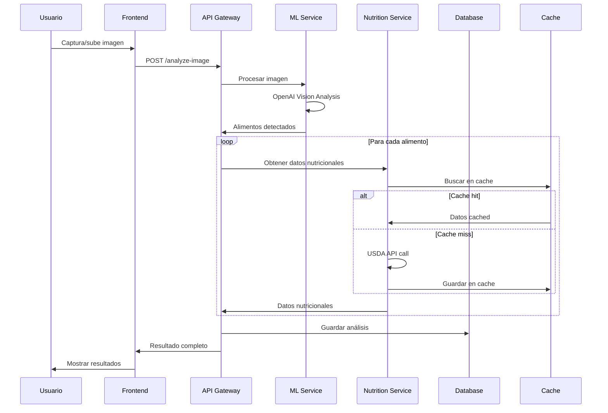

# 🏗️ Arquitectura Detallada - Contador de Calorías

**Fecha**: 14 de Septiembre, 2025  
**Fase**: 1 - Semana 1, Días 5-7  
**Estado**: 🟡 En desarrollo

## 📋 Resumen Ejecutivo

Diseño de arquitectura técnica detallada basada en los resultados exitosos de la investigación de APIs (Días 1-4). Sistema distribuido con microservicios para análisis de imágenes de alimentos y cálculo nutricional.

## 🏛️ Arquitectura General

### Diagrama de Alto Nivel
```
┌─────────────────┐    ┌─────────────────┐    ┌─────────────────┐
│   Frontend      │    │   API Gateway   │    │   ML Service    │
│   (React SPA)   │◄──►│   (FastAPI)     │◄──►│ (OpenAI Vision) │
└─────────────────┘    └─────────────────┘    └─────────────────┘
                                │
                                ▼
                       ┌─────────────────┐
                       │  Core Services  │
                       │                 │
                       │ ┌─────────────┐ │
                       │ │ Nutrition   │ │
                       │ │ Service     │ │
                       │ └─────────────┘ │
                       │ ┌─────────────┐ │
                       │ │ User        │ │
                       │ │ Service     │ │
                       │ └─────────────┘ │
                       │ ┌─────────────┐ │
                       │ │ Analytics   │ │
                       │ │ Service     │ │
                       │ └─────────────┘ │
                       └─────────────────┘
                                │
                                ▼
                       ┌─────────────────┐
                       │   Data Layer    │
                       │                 │
                       │ ┌─────────────┐ │
                       │ │ PostgreSQL  │ │
                       │ │ (Principal) │ │
                       │ └─────────────┘ │
                       │ ┌─────────────┐ │
                       │ │ Redis       │ │
                       │ │ (Cache)     │ │
                       │ └─────────────┘ │
                       └─────────────────┘
```

## 🔧 Componentes Técnicos

### 1. Frontend Layer

#### **React SPA (Single Page Application)**
```typescript
// Estructura de componentes
src/
├── components/
│   ├── Camera/
│   │   ├── CameraCapture.tsx
│   │   ├── ImagePreview.tsx
│   │   └── UploadButton.tsx
│   ├── Results/
│   │   ├── NutritionCard.tsx
│   │   ├── CaloriesSummary.tsx
│   │   └── MacronutrientsChart.tsx
│   └── Common/
│       ├── Header.tsx
│       ├── Loading.tsx
│       └── ErrorBoundary.tsx
├── services/
│   ├── api.ts
│   ├── camera.ts
│   └── storage.ts
├── hooks/
│   ├── useCamera.ts
│   ├── useNutrition.ts
│   └── useAnalytics.ts
└── utils/
    ├── imageProcessing.ts
    ├── validation.ts
    └── constants.ts
```

**Tecnologías**:
- **React 18** con TypeScript
- **Tailwind CSS** para estilos
- **React Query** para estado del servidor
- **React Hook Form** para formularios
- **Vite** como bundler

### 2. API Gateway Layer

#### **FastAPI Gateway**
```python
# Estructura del API Gateway
app/
├── main.py                 # Aplicación principal
├── routers/
│   ├── auth.py            # Autenticación
│   ├── images.py          # Procesamiento de imágenes
│   ├── nutrition.py       # Datos nutricionales
│   └── analytics.py       # Métricas y análisis
├── middleware/
│   ├── cors.py            # CORS handling
│   ├── rate_limit.py      # Rate limiting
│   └── logging.py         # Logging centralizado
├── services/
│   ├── ml_service.py      # Integración ML
│   ├── nutrition_service.py
│   └── user_service.py
└── models/
    ├── requests.py        # Modelos de request
    ├── responses.py       # Modelos de response
    └── database.py        # Modelos de DB
```

**Endpoints Principales**:
```python
# Análisis de imágenes
POST /api/v1/analyze-image
GET  /api/v1/analysis/{analysis_id}

# Datos nutricionales
GET  /api/v1/foods/search
GET  /api/v1/foods/{food_id}/nutrition

# Usuario
POST /api/v1/users/register
POST /api/v1/users/login
GET  /api/v1/users/profile

# Analytics
GET  /api/v1/analytics/daily-summary
GET  /api/v1/analytics/trends
```

### 3. ML Service Layer

#### **OpenAI Vision Integration**
```python
# Servicio de análisis de imágenes
class VisionAnalyzer:
    def __init__(self):
        self.client = OpenAI(api_key=settings.OPENAI_API_KEY)
    
    async def analyze_food_image(self, image_data: bytes) -> FoodAnalysis:
        """
        Analiza imagen y extrae información de alimentos
        """
        response = await self.client.chat.completions.create(
            model="gpt-4-vision-preview",
            messages=[{
                "role": "user",
                "content": [
                    {"type": "text", "text": FOOD_ANALYSIS_PROMPT},
                    {"type": "image_url", "image_url": {"url": image_data}}
                ]
            }],
            max_tokens=500
        )
        
        return self._parse_analysis(response.choices[0].message.content)
```

**Prompt Engineering**:
```python
FOOD_ANALYSIS_PROMPT = """
Analiza esta imagen de alimentos y proporciona:
1. Lista de alimentos identificados
2. Estimación de porciones (gramos/unidades)
3. Nivel de confianza (1-10)
4. Contexto adicional (preparación, ingredientes visibles)

Formato JSON:
{
  "foods": [
    {
      "name": "nombre_alimento",
      "portion_grams": 150,
      "confidence": 8,
      "notes": "descripción adicional"
    }
  ],
  "overall_confidence": 7,
  "image_quality": "good|fair|poor"
}
"""
```

### 4. Core Services Layer

#### **Nutrition Service**
```python
class NutritionService:
    def __init__(self):
        self.usda_client = USDAClient()
        self.nutritionix_client = NutritionixClient()
        self.cache = RedisCache()
    
    async def get_nutrition_data(self, food_name: str, portion_grams: float):
        # 1. Buscar en cache
        cached = await self.cache.get(f"nutrition:{food_name}")
        if cached:
            return self._calculate_portion(cached, portion_grams)
        
        # 2. Buscar en USDA (fuente primaria)
        usda_data = await self.usda_client.search_food(food_name)
        if usda_data:
            await self.cache.set(f"nutrition:{food_name}", usda_data)
            return self._calculate_portion(usda_data, portion_grams)
        
        # 3. Fallback a Nutritionix
        nutritionix_data = await self.nutritionix_client.get_nutrition(
            f"{portion_grams}g {food_name}"
        )
        return nutritionix_data
```

#### **User Service**
```python
class UserService:
    def __init__(self):
        self.db = DatabaseConnection()
        self.auth = AuthManager()
    
    async def create_analysis_record(self, user_id: int, analysis: FoodAnalysis):
        """Guardar análisis en historial del usuario"""
        record = AnalysisRecord(
            user_id=user_id,
            foods_detected=analysis.foods,
            total_calories=analysis.total_calories,
            image_hash=analysis.image_hash,
            confidence_score=analysis.confidence,
            created_at=datetime.utcnow()
        )
        return await self.db.save(record)
```

### 5. Data Layer

#### **PostgreSQL Schema**
```sql
-- Usuarios
CREATE TABLE users (
    id SERIAL PRIMARY KEY,
    email VARCHAR(255) UNIQUE NOT NULL,
    password_hash VARCHAR(255) NOT NULL,
    profile JSONB,
    created_at TIMESTAMP DEFAULT NOW(),
    updated_at TIMESTAMP DEFAULT NOW()
);

-- Análisis de imágenes
CREATE TABLE food_analyses (
    id SERIAL PRIMARY KEY,
    user_id INTEGER REFERENCES users(id),
    image_hash VARCHAR(64) NOT NULL,
    foods_detected JSONB NOT NULL,
    total_calories DECIMAL(8,2),
    total_protein DECIMAL(8,2),
    total_carbs DECIMAL(8,2),
    total_fat DECIMAL(8,2),
    confidence_score INTEGER,
    processing_time_ms INTEGER,
    created_at TIMESTAMP DEFAULT NOW()
);

-- Cache de alimentos
CREATE TABLE food_cache (
    id SERIAL PRIMARY KEY,
    food_name VARCHAR(255) UNIQUE NOT NULL,
    nutrition_data JSONB NOT NULL,
    source VARCHAR(50) NOT NULL, -- 'usda' | 'nutritionix'
    last_updated TIMESTAMP DEFAULT NOW()
);

-- Índices para performance
CREATE INDEX idx_food_analyses_user_id ON food_analyses(user_id);
CREATE INDEX idx_food_analyses_created_at ON food_analyses(created_at);
CREATE INDEX idx_food_cache_name ON food_cache(food_name);
```

#### **Redis Cache Strategy**
```python
# Estrategia de cache
CACHE_KEYS = {
    "nutrition": "nutrition:{food_name}",      # TTL: 7 días
    "user_session": "session:{user_id}",      # TTL: 24 horas
    "api_rate_limit": "rate:{ip}:{endpoint}", # TTL: 1 hora
    "analysis_result": "analysis:{hash}",     # TTL: 1 hora
}

# Configuración Redis
REDIS_CONFIG = {
    "host": "localhost",
    "port": 6379,
    "db": 0,
    "max_connections": 20,
    "retry_on_timeout": True,
    "socket_keepalive": True,
    "socket_keepalive_options": {}
}
```

## 🔄 Flujo de Datos

### Proceso de Análisis de Imagen


## 📊 Estimaciones de Performance

### Métricas Objetivo
| Métrica | Objetivo | Estrategia |
|---------|----------|------------|
| Tiempo de análisis | < 5 segundos | Cache + optimización de APIs |
| Throughput | 100 req/min | Rate limiting + escalado horizontal |
| Disponibilidad | 99.5% | Health checks + retry logic |
| Precisión ML | > 85% | Prompt engineering + validación |

### Escalabilidad
```python
# Configuración de escalado
SCALING_CONFIG = {
    "api_gateway": {
        "min_instances": 2,
        "max_instances": 10,
        "cpu_threshold": 70,
        "memory_threshold": 80
    },
    "ml_service": {
        "min_instances": 1,
        "max_instances": 5,
        "queue_threshold": 10
    },
    "database": {
        "connection_pool": 20,
        "read_replicas": 2
    }
}
```

## 🔒 Seguridad

### Autenticación y Autorización
```python
# JWT Token Strategy
JWT_CONFIG = {
    "algorithm": "HS256",
    "access_token_expire": 30,  # minutos
    "refresh_token_expire": 7,  # días
    "secret_key": "env:JWT_SECRET_KEY"
}

# Rate Limiting
RATE_LIMITS = {
    "/api/v1/analyze-image": "10/minute",
    "/api/v1/foods/search": "100/minute",
    "/api/v1/users/login": "5/minute"
}
```

### Validación de Datos
```python
# Pydantic Models para validación
class ImageAnalysisRequest(BaseModel):
    image: str  # Base64 encoded
    max_file_size: int = Field(default=5_000_000)  # 5MB
    allowed_formats: List[str] = ["jpg", "jpeg", "png", "webp"]

class NutritionResponse(BaseModel):
    foods: List[FoodItem]
    total_calories: float = Field(ge=0, le=10000)
    confidence: int = Field(ge=1, le=10)
    processing_time_ms: int
```

## 🚀 Próximos Pasos

### Días 6-7: Implementación
1. **Esquema de base de datos detallado**
2. **Definición de APIs internas**
3. **Diagramas de secuencia específicos**
4. **Plan de testing y validación**

---

**Estado**: 🟡 Arquitectura en desarrollo  
**Siguiente**: Esquemas detallados y APIs internas  
**Estimación**: 2 días para completar diseño técnico