# 🔄 Diagramas de Flujo - Contador de Calorías

**Fecha**: 14 de Septiembre, 2025  
**Versión**: 1.0  
**Herramientas**: Mermaid, PlantUML

## 📋 Resumen

Diagramas detallados de flujo de datos y secuencias para todos los procesos críticos del sistema de análisis nutricional por imágenes.

## 🖼️ Flujo Principal: Análisis de Imagen

### Diagrama de Secuencia Completo
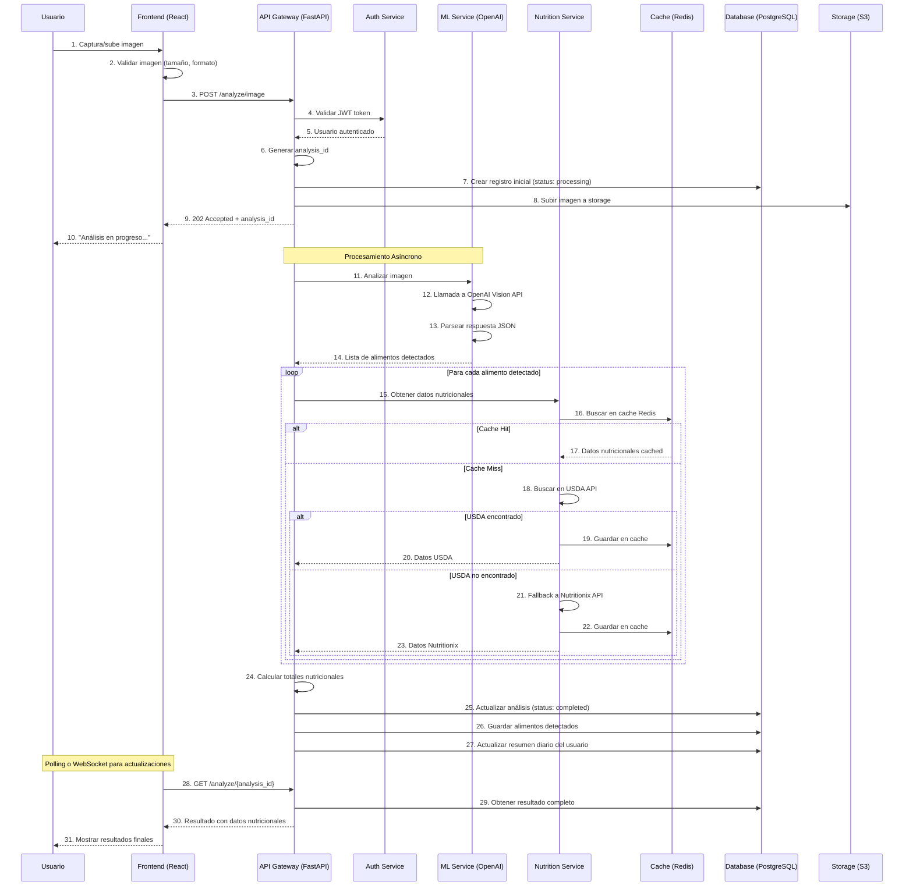

### Flujo de Estados del Análisis
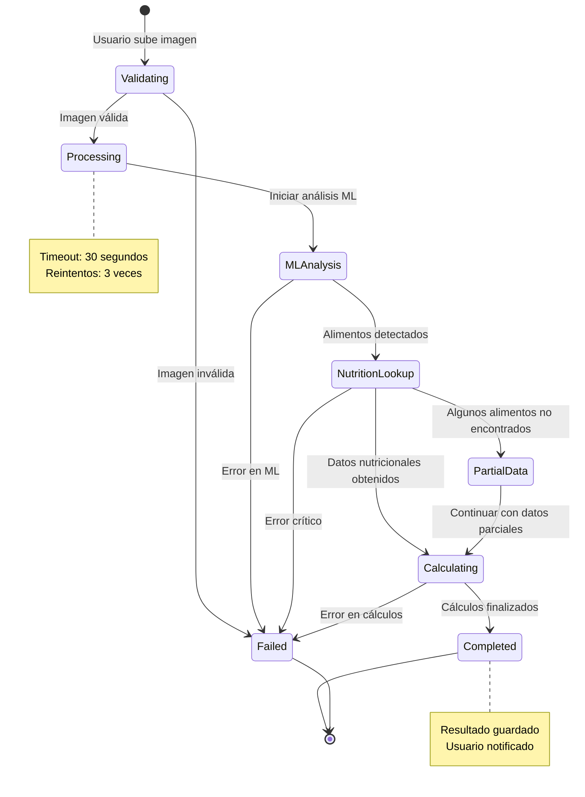

## 🔍 Flujo de Búsqueda de Alimentos

### Diagrama de Secuencia
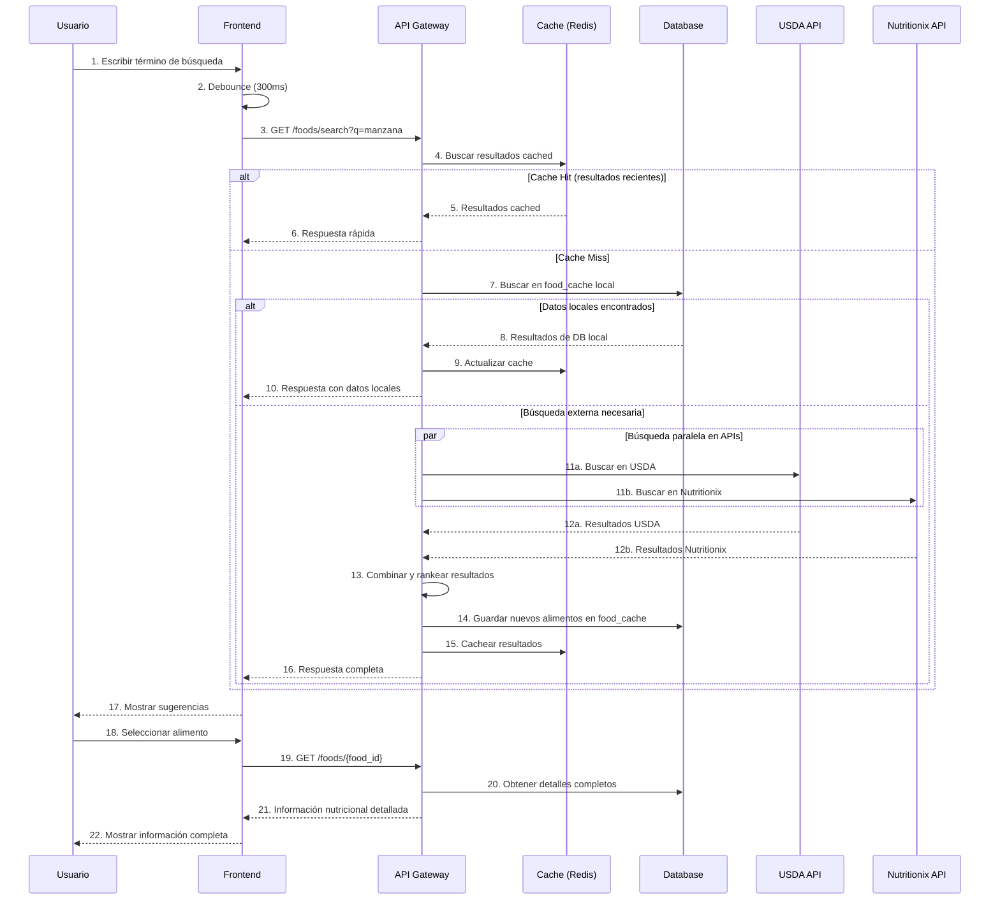

## 👤 Flujo de Autenticación

### Registro de Usuario
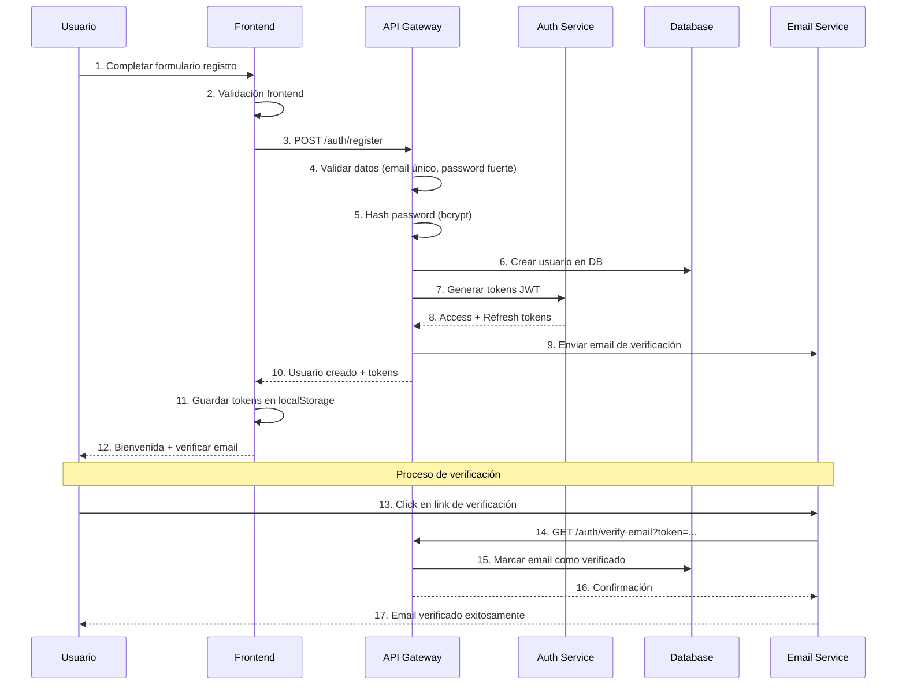

### Login y Renovación de Token
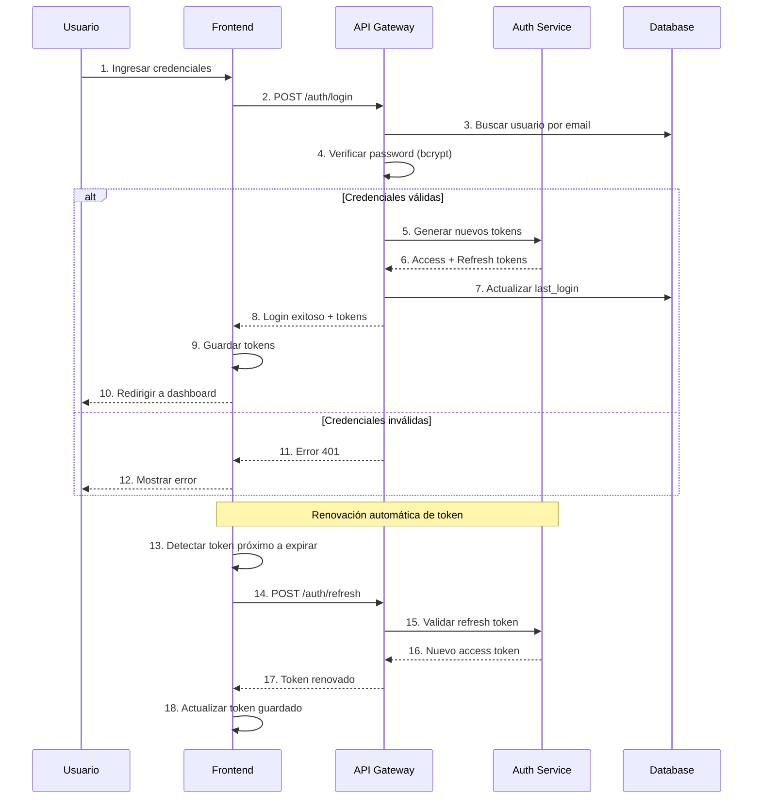

## 📊 Flujo de Analytics

### Generación de Resumen Diario
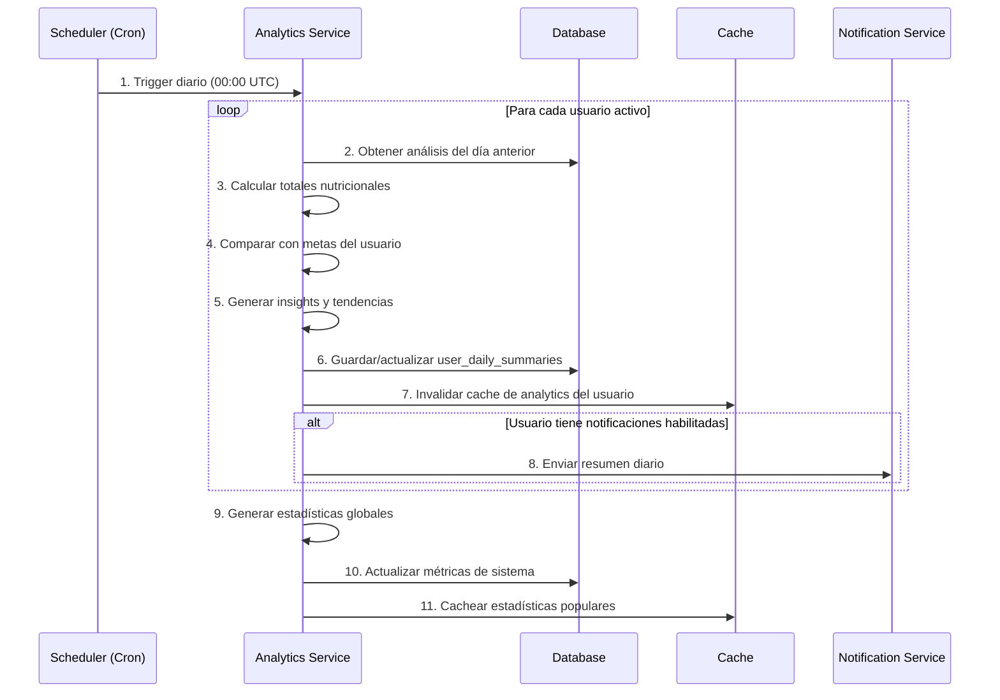

### Consulta de Tendencias
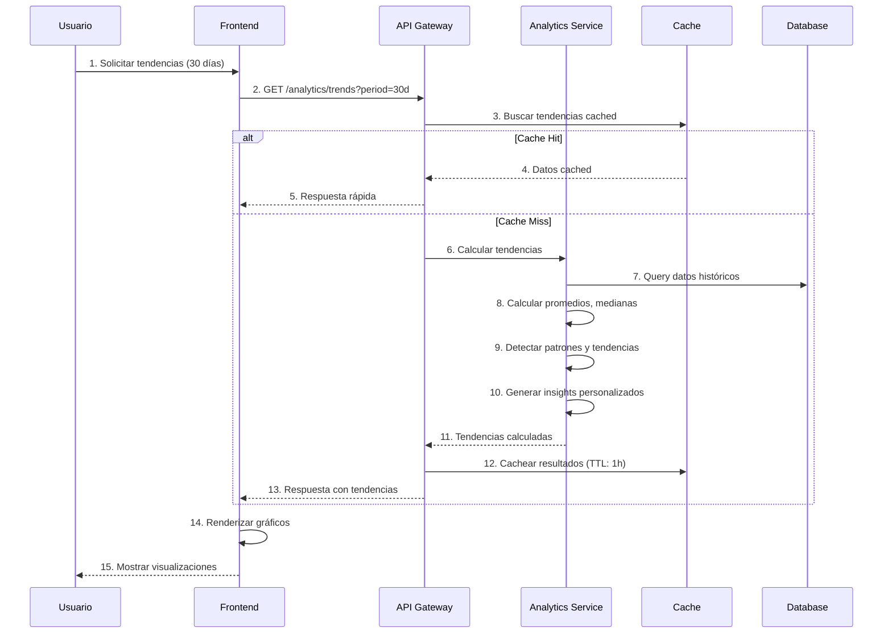

## 🔄 Flujo de Sincronización de Cache

### Estrategia de Cache Multi-Nivel
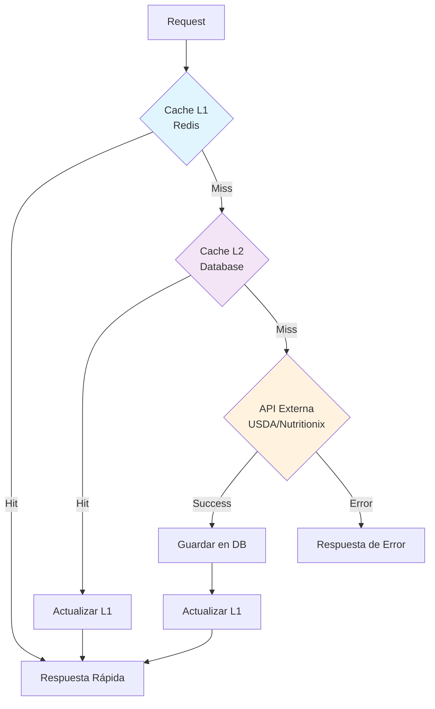

### Invalidación de Cache
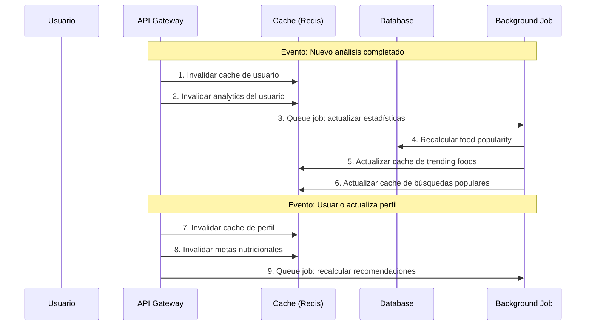

## 🚨 Flujo de Manejo de Errores

### Estrategia de Retry y Fallback
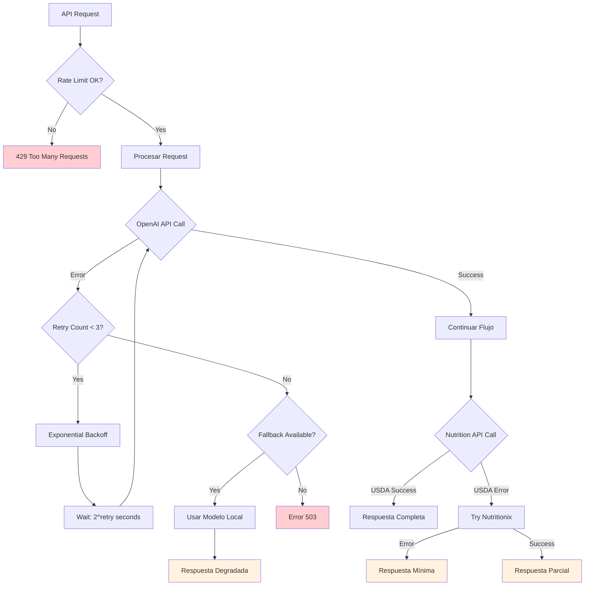

## 📱 Flujo de Experiencia de Usuario

### Flujo Completo de Análisis (UX)
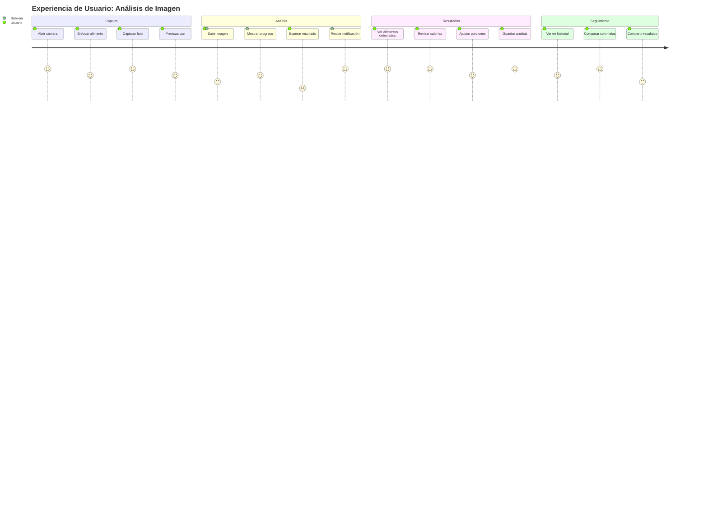

## 🔧 Configuración de Timeouts

### Timeouts por Servicio
```yaml
timeouts:
  api_gateway:
    request_timeout: 30s
    keepalive_timeout: 65s
  
  ml_service:
    openai_timeout: 25s
    analysis_timeout: 30s
    retry_delay: 2s
  
  nutrition_service:
    usda_timeout: 5s
    nutritionix_timeout: 8s
    cache_timeout: 1s
  
  database:
    connection_timeout: 5s
    query_timeout: 10s
    transaction_timeout: 15s
  
  cache:
    redis_timeout: 1s
    connection_pool_timeout: 2s
```

---

**Estado**: ✅ Diagramas completos  
**Herramientas**: Mermaid para visualización  
**Siguiente**: Plan de testing y validación